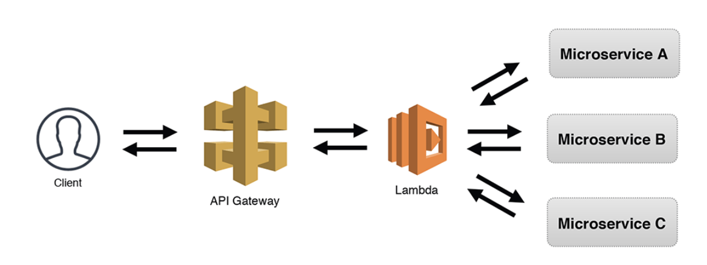

## 什么是Serverless
在实践Lambda应用之前，我们先来了解一下Serverless概念。
如同许多新的概念一样，Serverless目前还没有一个普遍公认的权威的定义。最新的一个定义是这样描述的：“无服务器架构是基于互联网的系统，其中应用开发不使用常规的服务进程。相反，它们仅依赖于第三方服务，客户端逻辑和服务托管远程过程调用的组合。”
这句话明确两个点：
    1. Serverless的存在并不是为了“无服务器”。
    2. 容器化依赖第三方托管的服务器。
简单的说，Serverless是想让开发人员专注业务开发，而不需要管理任何基础设施的一种服务架构。

## Serverless有什么好处


## 容器化的Serverless应用
从容器化技术演进的这张图上，看一下Serverless的位置。


这里拿AWS Lambda举例子，实际上Serverless是容器化技术的一种应用。它提供了不需要管理基础设置，面向软件开发人员，解决除了开发业务功能外的基础设施相关的问题。包括服务器，虚拟机，容器，服务治理，权限等等。其实上述的所有功能，都有成熟的框架和产品，但Serverless对使用者，屏蔽了这些功能的配置，提供了开箱即用的功能。

## Serverless解决什么问题
根据AWS的Blog的宣传，我们看到Serverless的优势包括一下几个点
```
# No servers to manage
# Continuous scaling
# Millisecond metering
# Increases innovation
# Modernize your applications
# Rich ecosystem
```
我们部署一个Lambda，体验一下这些功能点。

## AWS Lambda实践

### 基本使用
Lambda的函数开发，支持多种语言版本，包括Node.js 12.X，14.X, .Net Core 3.1, Python3.6-3.9, Ruby2.7,Java 8,11等，我们开发一个Java版本的函数。
可以通过本地IDE编写，也可以通过AWS提供的线上控制台，工具包等多种开发环境。

我们通过Java版本来体验一下。

#### 创建函数
TODO

#### 创建层
TODO

#### 部署函数
TODO


## Lambda 和 容器化的对比


## 复杂的业务模型




## 参照文章

[https://landscape.cncf.io/serverless](https://landscape.cncf.io/serverless)

[https://aws.amazon.com/cn/blogs/china/iaas-faas-serverless/](https://aws.amazon.com/cn/blogs/china/iaas-faas-serverless/)

[https://docs.aws.amazon.com/zh_cn/whitepapers/latest/security-overview-aws-lambda/benefits-of-lambda.html](https://docs.aws.amazon.com/zh_cn/whitepapers/latest/security-overview-aws-lambda/benefits-of-lambda.html)
