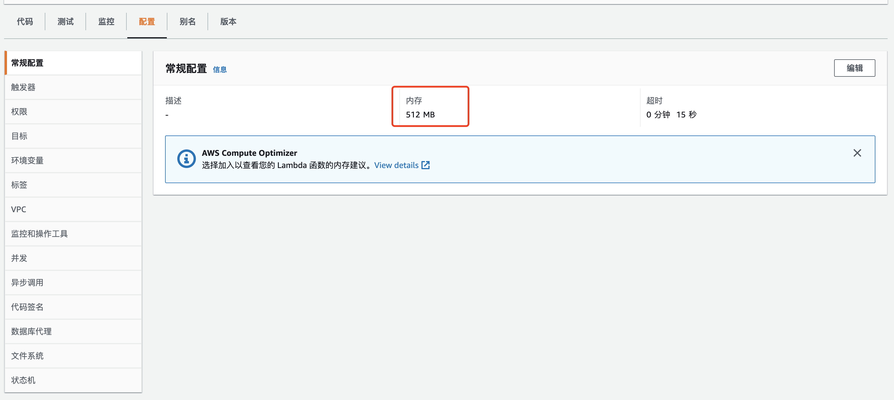
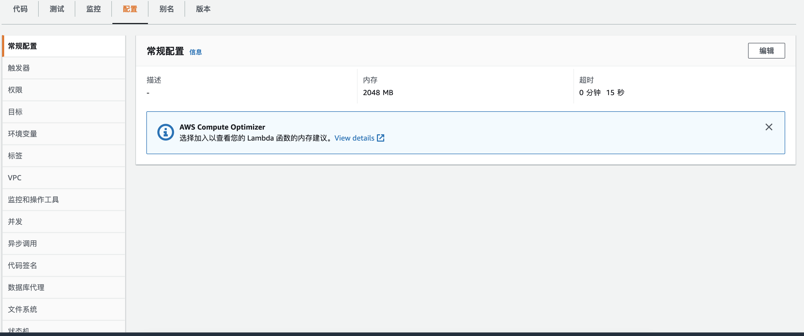

<!--more-->

## 背景
部署一个应用，我们需要确定一下成本和性能，Lambda函数也一样。按照AWS的说明，默认的Lambda是512M内存的配置，可以上线到10GB，但没有CPU核数的选项。我们是否能充分利用一个Lambda函数的全部性能呢。

## 本地
我们部署下面一段代码，使用系统默认线程池来测试一下线程的支持情况。
```
logger.info("availableProcessors: " + Runtime.getRuntime().availableProcessors());

        IntStream.range(1, 10).parallel().forEach(id->{
            logger.info("Thread: " + Thread.currentThread());
            logger.info("ForkJoinPool Size: " + ForkJoinPool.commonPool().getPoolSize());

            try {
                Thread.sleep(2000);
            } catch (InterruptedException e) {
                // TODO Auto-generated catch block
                e.printStackTrace();
            }
        });
```

我本地cpu是i5，2核线程增强型，所以应该有4个并发线程可以使用。结果也如预期；
```
12:11:08.888 [main] INFO com.snack.learning.threadinlambda.ThreadInLocalApplication - availableProcessors: 4
12:11:09.038 [main] INFO com.snack.learning.threadinlambda.ThreadInLocalApplication - Thread: Thread[main,5,main]
12:11:09.038 [ForkJoinPool.commonPool-worker-1] INFO com.snack.learning.threadinlambda.ThreadInLocalApplication - Thread: Thread[ForkJoinPool.commonPool-worker-1,5,main]
12:11:09.038 [ForkJoinPool.commonPool-worker-1] INFO com.snack.learning.threadinlambda.ThreadInLocalApplication - ForkJoinPool Size: 3
12:11:09.038 [ForkJoinPool.commonPool-worker-2] INFO com.snack.learning.threadinlambda.ThreadInLocalApplication - Thread: Thread[ForkJoinPool.commonPool-worker-2,5,main]
12:11:09.038 [ForkJoinPool.commonPool-worker-2] INFO com.snack.learning.threadinlambda.ThreadInLocalApplication - ForkJoinPool Size: 3
12:11:09.038 [ForkJoinPool.commonPool-worker-3] INFO com.snack.learning.threadinlambda.ThreadInLocalApplication - Thread: Thread[ForkJoinPool.commonPool-worker-3,5,main]
12:11:09.039 [ForkJoinPool.commonPool-worker-3] INFO com.snack.learning.threadinlambda.ThreadInLocalApplication - ForkJoinPool Size: 3
12:11:09.040 [main] INFO com.snack.learning.threadinlambda.ThreadInLocalApplication - ForkJoinPool Size: 3
12:11:11.039 [ForkJoinPool.commonPool-worker-1] INFO com.snack.learning.threadinlambda.ThreadInLocalApplication - Thread: Thread[ForkJoinPool.commonPool-worker-1,5,main]
12:11:11.039 [ForkJoinPool.commonPool-worker-2] INFO com.snack.learning.threadinlambda.ThreadInLocalApplication - Thread: Thread[ForkJoinPool.commonPool-worker-2,5,main]
12:11:11.039 [ForkJoinPool.commonPool-worker-1] INFO com.snack.learning.threadinlambda.ThreadInLocalApplication - ForkJoinPool Size: 3
12:11:11.039 [ForkJoinPool.commonPool-worker-2] INFO com.snack.learning.threadinlambda.ThreadInLocalApplication - ForkJoinPool Size: 3
12:11:11.039 [ForkJoinPool.commonPool-worker-3] INFO com.snack.learning.threadinlambda.ThreadInLocalApplication - Thread: Thread[ForkJoinPool.commonPool-worker-3,5,main]
12:11:11.039 [ForkJoinPool.commonPool-worker-3] INFO com.snack.learning.threadinlambda.ThreadInLocalApplication - ForkJoinPool Size: 3
12:11:11.045 [main] INFO com.snack.learning.threadinlambda.ThreadInLocalApplication - Thread: Thread[main,5,main]
12:11:11.045 [main] INFO com.snack.learning.threadinlambda.ThreadInLocalApplication - ForkJoinPool Size: 3
12:11:13.093 [ForkJoinPool.commonPool-worker-2] INFO com.snack.learning.threadinlambda.ThreadInLocalApplication - Thread: Thread[ForkJoinPool.commonPool-worker-2,5,main]
12:11:13.093 [ForkJoinPool.commonPool-worker-2] INFO com.snack.learning.threadinlambda.ThreadInLocalApplication - ForkJoinPool Size: 3
```

## Lambda 512M版本
把同样的代码，发布到AWS上的Lambda函数上，使用默认配置，内存512M。结果如下：


```
2022-01-26T11:37:55.450+08:00	03:37:55.447 [main] INFO com.snack.learning.ThreadInLambda - availableProcessors: 2

2022-01-26T11:37:55.455+08:00	03:37:55.455 [main] INFO com.snack.learning.ThreadInLambda - Thread: Thread[main,5,main]

2022-01-26T11:37:55.455+08:00	03:37:55.455 [main] INFO com.snack.learning.ThreadInLambda - ForkJoinPool Size: 1

2022-01-26T11:37:55.455+08:00	03:37:55.455 [ForkJoinPool.commonPool-worker-1] INFO com.snack.learning.ThreadInLambda - Thread: Thread[ForkJoinPool.commonPool-worker-1,5,main]

2022-01-26T11:37:55.455+08:00	03:37:55.455 [ForkJoinPool.commonPool-worker-1] INFO com.snack.learning.ThreadInLambda - ForkJoinPool Size: 1

2022-01-26T11:37:57.455+08:00	03:37:57.455 [main] INFO com.snack.learning.ThreadInLambda - Thread: Thread[main,5,main]

2022-01-26T11:37:57.456+08:00	03:37:57.455 [main] INFO com.snack.learning.ThreadInLambda - ForkJoinPool Size: 1

2022-01-26T11:37:57.456+08:00	03:37:57.455 [ForkJoinPool.commonPool-worker-1] INFO com.snack.learning.ThreadInLambda - Thread: Thread[ForkJoinPool.commonPool-worker-1,5,main]

2022-01-26T11:37:57.456+08:00	03:37:57.456 [ForkJoinPool.commonPool-worker-1] INFO com.snack.learning.ThreadInLambda - ForkJoinPool Size: 1

2022-01-26T11:37:59.456+08:00	03:37:59.456 [main] INFO com.snack.learning.ThreadInLambda - Thread: Thread[main,5,main]

2022-01-26T11:37:59.456+08:00	03:37:59.456 [main] INFO com.snack.learning.ThreadInLambda - ForkJoinPool Size: 1

2022-01-26T11:37:59.456+08:00	03:37:59.456 [ForkJoinPool.commonPool-worker-1] INFO com.snack.learning.ThreadInLambda - Thread: Thread[ForkJoinPool.commonPool-worker-1,5,main]

2022-01-26T11:37:59.456+08:00	03:37:59.456 [ForkJoinPool.commonPool-worker-1] INFO com.snack.learning.ThreadInLambda - ForkJoinPool Size: 1

2022-01-26T11:38:01.456+08:00	03:38:01.456 [main] INFO com.snack.learning.ThreadInLambda - Thread: Thread[main,5,main]

2022-01-26T11:38:01.456+08:00	03:38:01.456 [ForkJoinPool.commonPool-worker-1] INFO com.snack.learning.ThreadInLambda - Thread: Thread[ForkJoinPool.commonPool-worker-1,5,main]

2022-01-26T11:38:01.456+08:00	03:38:01.456 [ForkJoinPool.commonPool-worker-1] INFO com.snack.learning.ThreadInLambda - ForkJoinPool Size: 1

2022-01-26T11:38:01.456+08:00	03:38:01.456 [main] INFO com.snack.learning.ThreadInLambda - ForkJoinPool Size: 1

2022-01-26T11:38:03.457+08:00	03:38:03.457 [main] INFO com.snack.learning.ThreadInLambda - Thread: Thread[main,5,main]

2022-01-26T11:38:03.457+08:00	03:38:03.457 [main] INFO com.snack.learning.ThreadInLambda - ForkJoinPool Size: 1
```

可以看到，Lambda函数是单核线程增强型，共有2个进程。

## Lambda 2048M版本
我们尝试增加Lambda使用内存数，日志结果没有区别，还是2个线程数。


## 结论
从Lambda的参数设定，推测Lambda函数设计有两点：
    1. 单线程。函数就是无状态的实例节点，并发调用的场合，交给上游Lambda函数并发调用。
    2. 提升单线程的执行效率。通过内存的提升，提升一个函数的响应时间，AWS也增加了15分钟的超时限制。尽可能的限制函数的复杂性。

我们部署函数，也要遵循上述的方式，尽量把函数拆成单一的动作及结果返回，才能最大程度的利用函数自身的特性。

## 代码参照
你可以通过 https://github.com/snack8310/thread-in-lambda 下载源代码
