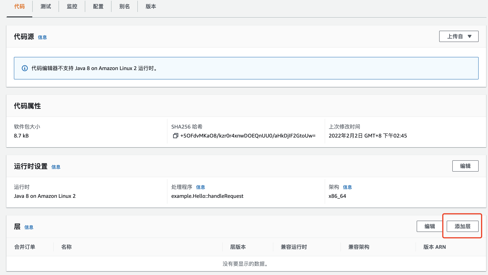
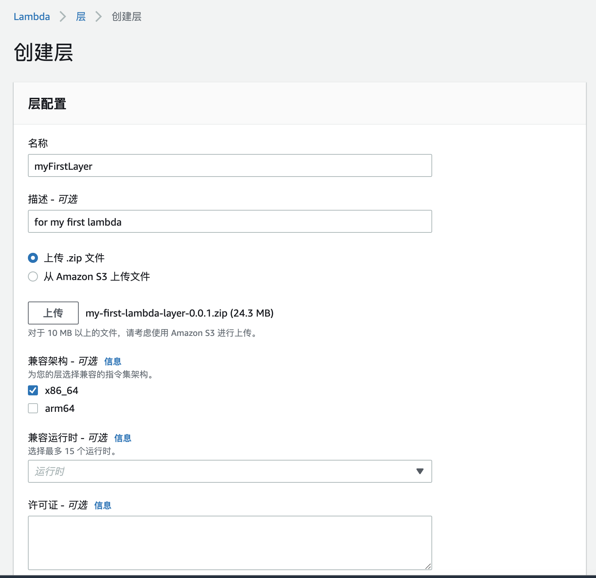

## 什么是Lambda函数
Lambda是AWS面向开发人员推出的应用层级Serverless解决方案。使用通过符合Lambda规范的代码，在AWS的环境上快速部署线上使用。通过配置支持自动扩容，安全，权限，网关等，完全屏蔽底层服务器管理的功能。

## Lambda的优势
根据AWS的Blog的宣传，我们看到Serverless的优势包括一下几个点
```
# 无服务器管理
# 连续缩放
# 毫秒级
# 丰富生态
# 增加创新
```
我们部署一个Lambda，体验一下这些功能点。

## AWS Lambda实践

### 基本使用
Lambda的函数开发，支持多种语言版本，包括Node.js 12.X，14.X, .Net Core 3.1, Python3.6-3.9, Ruby2.7,Java 8,11等，我们开发一个Java版本的函数。
可以通过本地IDE编写，也可以通过AWS提供的线上控制台，工具包等多种开发环境。

我们通过Java版本来体验一下。
本文代码可以在
> https://github.com/snack8310/my-first-lambda

下载。本案例是个使用gradle的Springboot的工程。

也可以参照官方推荐的JAVA DEMO
> https://github.com/awsdocs/aws-lambda-developer-guide/tree/main/sample-apps/blank-java


### 基本概念
Function：核心代码。
Trigger：触发器。例如APIGateway，SNS等，用来调用函数的资源。
Event：调用函数的数据。
Layer：Lambda 层是可以包含其他代码或其他内容的 .zip 文件归档。层可以包含库、自定义运行时、数据或配置文件。
其他的，不影响使用，可以慢慢扩展。

### 核心函数解读

```
public class MyFirstLambdaRequestHandler implements RequestHandler<APIGatewayProxyRequestEvent, Object> {

    private static final Logger logger = LoggerFactory.getLogger(MyFirstLambdaRequestHandler.class);

    @Override
    public Object handleRequest(APIGatewayProxyRequestEvent input, Context context) {
        logger.info("MyFirstLambdaRequestHandler: " + input.getBody());
        return new APIGatewayProxyResponseEvent().withBody("Hello world, " + input.getBody()).withStatusCode(200);
    }
}
```
代码引入了APIGateway调用方式的函数代理，做了简单的函数名称打印，准备做一个API网关调用的展示。
这个代码就是函数的入口和全部业务实现。

### 创建层
Layer（层）是个可选项，一个函数最多添加5层。层的引入，是为了缩小核心代码上传的部署成本，促进代码共享和责任分离，把公共部分，主要的jar包，放到公共层中，减少核心业务代码的变更成本。
执行Readme中的层编译代码生成层
```
set -eo pipefail
gradle -q packageLibs
mv build/distributions/my-first-lambda-0.0.1-SNAPSHOT.zip build/distributions/my-first-lambda-layer-0.0.1.zip    
```
按照下属步骤部署一个新层
1. 添加层

2. 创建层

3. 创建完成


### 部署函数
执行Readme中的层编译代码生成层
```
set -eo pipefail
gradle build
```

1. 按照下属步骤部署一个函数


2. 修改运行时设置的处理程序


### 运行测试
可以在本画面进行基本的调用测试

选择测试，可以直接点击测试，也可以模拟一个ApiGateway的调用，内容如下
```
{
  "body": "snack",
  "isBase64Encoded": true
}
```
1. 执行测试

2. 执行成功。点击（日志），可以看到这次的测试结果


到此为止，我们已经部署了一个线上的应用服务。

## 部署一个API网关，提供面向HTTP的访问。
1. 创建网关

2. 创建资源

3. 创建方法

4. 部署网关


AWS已经帮我们生成了一个对外可访问的网关，本地执行CURL，已经可以访问到。
```
huisheng@MacBook-Pro ~ % curl -X GET https://qvo9fbweyf.execute-api.us-east-1.amazonaws.com/dev/lambda -d '{"body":"snack"}'

{"statusCode":200,"body":"Hello world, snack"}%                                                                        huisheng@MacBook-Pro ~ % 

```
到现在为止，在没有任何关于服务器的设定配置的情况下，我们已经在互联网上部署了一个对外提供服务的应用。整个过程非常简单方便。小小的体验了一把无服务化。
后续我们会针对Lambda的函数特点做一些简单的测试，包括连续缩放和性能。

## Lambda 和 EKS（K8s）的对比
截止到本文发表，EKS已经是个云原生毕业，经得住大规模商业化的考验的成熟产品。可以适配多种云环境，支撑面向应用的屏蔽底层容器环境的差异性。但需要具备ec2/pod/container级别的处理能力，这与通常的业务实现的技术领域不同。
Lambda这类Serverless服务，现在还是在经历高速商业化发展的初期。现在有一些制约：有一定的代码侵入性，并且尚不支持一个标准协议提供跨平台迁移性。系统设计层面，对比传统的领域模型，也要有一定的理念转变。但优点也非常突：屏蔽了底层容器级别的技术处理复杂度，而且在经济上有很大的提升空间。
可以根据具体的项目场景和资源配置，灵活的选择这两种方案。

个人角度看，他们可能不是竞争对手的关系，而是一种发展关系。
> 无服务器对于K8s，就像K8s对于容器一样。

## 参照文章

[https://docs.aws.amazon.com/zh_cn/lambda/index.html](https://docs.aws.amazon.com/zh_cn/lambda/index.html)

[https://docs.aws.amazon.com/zh_cn/whitepapers/latest/security-overview-aws-lambda/benefits-of-lambda.html](https://docs.aws.amazon.com/zh_cn/whitepapers/latest/security-overview-aws-lambda/benefits-of-lambda.html)
