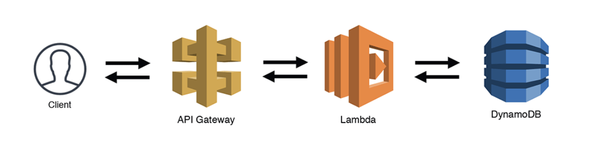
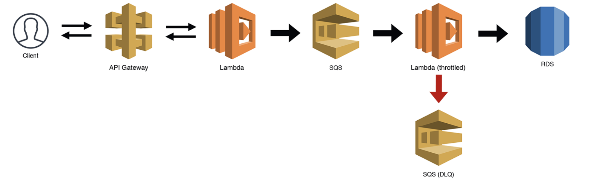

## 什么是Serverless

Serverless，直译过来，无服务器的意思。
当我们提到Serverless的时候，究竟是什么意思？

本质上讲，无服务器是一种设计方法，可以构建一整套应用程序，而无需直接管理服务器的一种方法。

那Serverless的好处是什么？
可以理解为无需直接管理服务器的好处是什么。等于服务器上都需要关心什么？从底下往上说，服务器：服务器配置，容量，性能；操作系统（OS）：版本，补丁，负载存储；容器（Container），版本，升级，编排，流量治理等等，直到应用层级。可以说，这里提到的点，就是Serverless好处。

Serverless是个典型的针对开发人员的架构技术。使用无服务器，我们不需要做任何其他的事情。部署即可用，可以自动扩容与缩减，不适用不付费；支持从CDN加速，应用，缓存，到存储及数据仓库。Serverless屏蔽了基础建设的复杂度，提供一个高可用的使用环境。提供更简单，友好的配置逻辑。及其快速的调用响应和休眠守护等功能。帮助开发人员减少部署成本，提高可扩展性。

广义上提到Serverless，会包括从应用被调用开始的资源，网关，应用，存储等等，整个环节的无服务器依赖。
但一般我们提到的Serverless，会主要集中在应用层面。主要原因是在这个链路上，制约无服务化的点，会出现在应用开发和数据存储的层面上。数据存储方面，通过一些Nosql的方式，能够通过脚本的扩容和缩放等可以自动维护的服务器的扩展性。但应用的场景就非常的复杂，如何能够更简单的维护应用环境是个非常大的挑战，这也是Serverless的概念的目的和起源。最早使用Serverless这个词的使用大约是2012年由Ken Form所写的一篇名为《Why The Future of Software and Apps is Serverless》的文章，也可以看出Serverless，现在更主要的集中在应用层面的解决方案上。

## 容器化技术演进
应用层面的解决方案，是依赖容器化服务的技术演进。Serverless也可以说是在基于容器化服务上的一组应用方案。

这里拿AWS Lambda举例子，只要按照Lambda的规范增加lib和调用入口，就可以部署一个开箱即用的应用。
它提供了不需要管理基础设置，面向软件开发人员，解决除了开发业务功能外的基础设施相关的问题。包括服务器，虚拟机，容器，服务治理，权限等等。上述的所有功能，都提供了较为成熟完整的产品方案，Serverless对使用者，屏蔽了这些功能的配置复杂度.

## 什么是Faas（Functions as a Service）
整个Serverless的核心，就是函数化。
函数化的标准就是输入，输出。通过实现标准化的输入输出，解决与基础组件的调用问题。享受基础组件管理编排的有点。
通常Faas会跟微服务（MicroService）对比。本质上说，这两个并不冲突，一般来说，都会按照一个领域模型来划分边界。但函数化的单一输入输出来说，通常Faas会比微服务的领域模型更加碎片化，如果一个领域模型是某一个资源的CRUD，那么Faas很可能会把CRUD拆分成四个独立的函数，提供给外部调用方使用。

云服务商大多提供了自己的Serverless的产品：比如AWS的Lambda，Azure的Functions。国内厂商中，也有很多推出了自己的Serverless产品，比如阿里云，华为云。

## 为什么用Serverless
新技术的应用，一定是为了让业务速度更快，包括部署速度，成本更低。serverless的竞争对手，就是容器化的应用，我们用AWS的产品对比，lambda函数比EKS。

### 部署更快
上面说了，参照标准接口定义，从实现到部署可用，仅仅需要几行代码。远比EKS，需要部署容器节点，网关等等很多配置。

### 成本更低
从规模角度看，EKS，是一个独立隔离的容器组，提前预留了规模。Lambda可以想象为AWS统一管理的大池子，在性能未充分利用的场景，一定会低于预留规模的容器组。从第一性原则看，一定会比EKS这种预留规模的容器组，成本更低。
从人员角度看，EKS需要配置人员要更多的了解服务底层的概念，才能做合适的配置，很多时候，还是需要专业的infra人员进行管理。Lambda从设计开始，就是面向应用开发人员，这部分成本一定会有差距。

### 扩展效率
从现在主流的产品的现状来看，Lambda函数明显在扩展效率上，远超EKS的效率。这可能跟函数碎片化的启动和完整服务化启动，不同体量的启动的差距有关，从设计模式来说，函数式的serverless是要快很多的。当然，这部分两种产品都在快速发展，未来可能无限趋同。

### 缺点
当然，serverless不是没有缺点。
第一，严重依赖某个服务商，无法做到云原生，现在这是非常重要的原因。
第二，serverless是对应用做了侵入，并且需要开发或架构师的思维做转变，能突破领域边界的碎片化应用。
第三，大规模的商业化应用，还未普及。

## 怎么用Serverless
参照AWS的官方模型，基本上，Serverless函数都是应用在整个无服务的场景下；与传统微服务化相互融合的方案，通常采用的都是单向调用的方式。
### 基本模式

### Lambda传递

### 与MicroService的调用

具体使用的方案，我们在其他的文章中，会陆续分享给大家。

## 总结
作为一个架构师来看，serverless一定是个领人激动的领域。这里有显著的成本下降，性能提升的空间，还可以把服务器的计算能力，发挥到更大。serverless也是个相对比较新鲜的领域，也是最近3，4年内发展起来的，需要我们更多的学习和研究。

## 参照

[https://aws.amazon.com/cn/blogs/china/iaas-faas-serverless/](https://aws.amazon.com/cn/blogs/china/iaas-faas-serverless/)

[https://acloudguru.com/blog/engineering/what-is-serverless](https://acloudguru.com/blog/engineering/what-is-serverless)