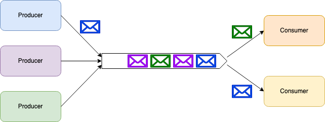
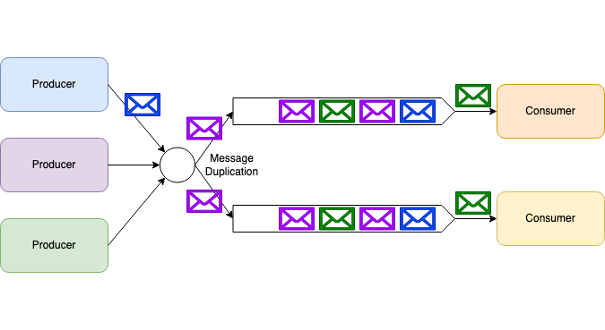
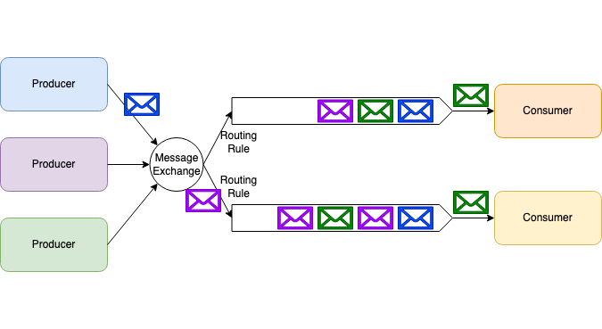
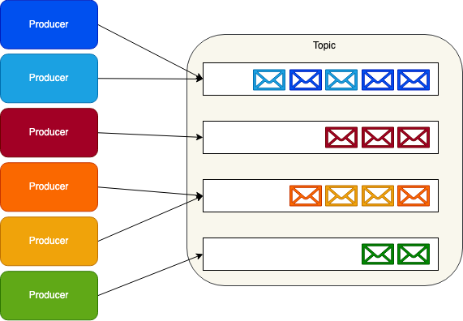
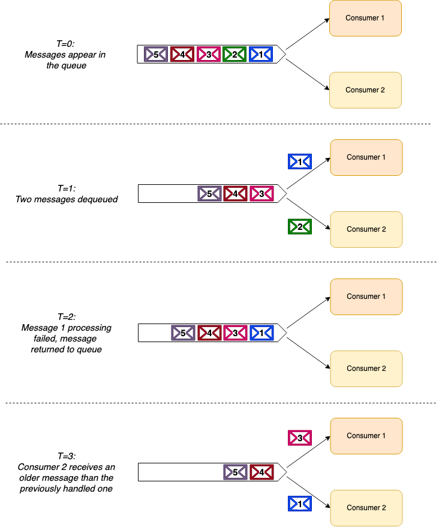
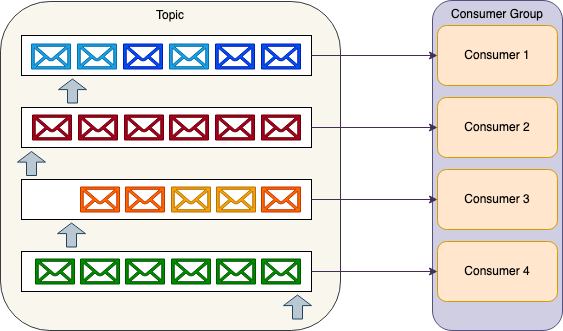
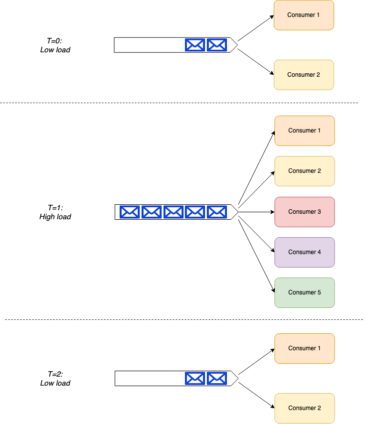

## 写在最前

本文翻译/修改自博客文章
- https://stiller.blog/2020/02/rabbitmq-vs-kafka-an-architects-dilemma-part-1/
- https://stiller.blog/2020/02/rabbitmq-vs-kafka-an-architects-dilemma-part-2/

当我面临着实践中的困境，两种工具都在日常使用。对MQ和Streaming存在困惑后，找到了一个能解决困惑的文章。记录在自己的blog中，后续会根据自己的知识，补足Kafka一些具体的场景和问题。

## 困惑

Kafka 和 RabbitMQ，很像，什么场景选择哪一个很困惑。这背后更多的一个事情是，Streaming 和 Message Queue的差异性是什么。
基于这个问题，讨论下两种模式的内部结构。

### 异步消息模式

这种传递消息的方式，分离生产者和消费者。处理异步消息，通常会选择两种模式--消息队列和发布/订阅

#### 消息队列

#### 发布/订阅

### RabbitMQ
RabbitMQ是消息代理（MessageBroker）的实现，也通常成为Service Bus。消息代理的流行产品还包括	，ActiveMQ，Azure ServiceBus，Amazon Simple Queue Service（SQS）

Queue模式

#### Apache Kafka
Kafka不是消息代理（MessageBroker）的实现，是一个分布式流平台（distributed streaming platform）。同样的流行产品包括，Azure Event Hubs， AWS Kinesis Data Streams

Topic模式

### 显著差异（Message Ordering）
RabbitMQ 是一个 消息代理，而 Apache Kafka 是一个 分布式流平台，这是个底层不同目标的设计产品。

### 消息排序
RabbitMQ：对消息顺序不提供任何顺序保障。当需要顺序性的场合，需要仅限于一个消费者，这牺牲并发的性能。当出现例如消费超时重试的场合，无法保证优先消费，RabbitMQ关于信息消费的方式如下：

Kafka：提供了可靠的消息顺序保证。所有发送到同一个topic的消息，都会按照顺序处理。生产者可以在每条消息通道上设置分区键以创建数据流，让消费者顺序处理。

### 消息路由（Message Routing）
RabbitMQ：可以根据订阅者定义的路由规则，将消息交付。允许消费者消费指定的消息类型。
消息队列的使用过程大概如下：
（1）客户端连接到消息队列服务器，打开一个channel。
（2）客户端声明一个exchange，并设置相关属性。
（3）客户端声明一个queue，并设置相关属性。
（4）客户端使用routing key，在exchange和queue之间建立好绑定关系。
（5）客户端投递消息到exchange。
Kafka：不允许消费者在轮询消息之前过滤主题中的消息。需要接收分区中的所有消息。

### 消息时间（Message Timing）
RabbitMQ：提供了多种功能：
消息生存时间（TTL）：自动删除过期消息，并放入死信队列中。
延迟消息：通过一些消息中间件，提供了延时发送消息的功能。
Kafka：不支持此功能。Kafka作为一个流平台，的设计目标是实时到达写入分区，提供消费者立即使用。Kafka的本质是写入分区Log，可以通过Log日志记录删除的方式清理事务日志，但这并不是为了解决消息时间。

### 消息保留（Message Retention）
RabbitMQ：消息消费后，会立即删除，这是所有消息代理设计的一部分。
Kafka：Kafka设计保存所有Topic的日志。并不关心Topic的消费状态。消费者可以根据偏移量随时调整过去的消费信息。

### 故障处理（Fault Handling）
这里两种方案有非常明显的不同：
RabbitMQ：当消费者处于处理消息故障的场合，其他消费者可以处理后面的消息。与消息的无序性有关系

Kafka：消费者出现重试的场合，是无法消费后面的消息。解决办法是手动调整消费偏移量。

### 规模（Scale）
通常来说，大家会认为Kafka提供了更好的性能，这基于Kafka使用顺序I/O，零拷贝等的设计机制。一般来说十万/秒的消息支撑能力是很容易的。
但RabbitMQ集群也是能足够支撑几万/秒的能力。
重要的是，一般规模的应用，是用不到如此高性能的规模。这两个模式都能很好的支持。

### 消费者复杂性（Consumer Complexity）
RabbitMQ：智能代理和愚蠢消费者（a smart broker / dumb consumer model ），可以灵活支撑消费者的扩展。

Kafka：愚蠢代理和智能消费者（a dumb-broker / smart consumer model ），需要在消费者内部协调主题分区。
kafka在负载的增加减少的场合，需要做更多的努力。Kafka-SDK会帮我们做一部分额外的工作。

### 如何选择
我们面临着不同的业务场景中选择消息模式，究竟要如何选择呢，基于上面的差异，我们能得到下面的这些结论。
1. 使用RabbitMQ更合适的场景：
    - 需要很灵活的路由规则
    - 需要定时/延时控制消息
    - 避免依赖消费者处理错误消息
    - 更简单的消费者要求
2. 使用Kafka更合适的场景：
   - 消息严格排序
   - 实时要求
   - 消息保存的持久性，重播消息的功能
   - 极高并发的要求。
除此之外，还要考虑研发人员对上述技术能力的掌握程度。例如KafkaSDK的学习成本。
很多场合，两种模式也能共存，这取决于维护人员成本。
例如基于事件驱动架构的系统中，使用RabbitMQ发送点对点的服务调用，解耦函数依赖。使用Kafka发送业务事件通知。比较显著的原因是，作为业务事件的存储和重放 ，是事件驱动架构设计的一个核心诉求。Kafka的事件保存机制更合理。另一方面，当我们需要解耦动作依赖，重试的场景下，RabbitMQ的表现更加突出。

## 结论
通过比较这两种模式，本质上的MQ和Streaming的异同，很多场景下，双方是可以互换的。但由于底层设计模型的不同，在一些细分场景下，两者也会有显著的优缺点。这需要架构师深入理解后，做更合适的选择。
